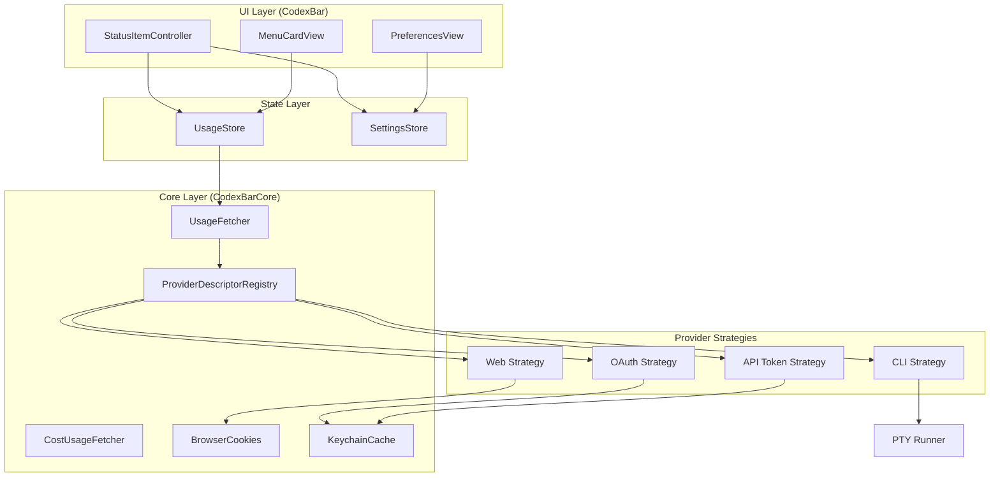

# Architecture Patterns

## Application Structure

### Application Type

- **Single-Page Application (SPA)**: Menu bar app with single preferences window
- **Rendering**: Client-side rendering (CSR) with SwiftUI
- **Platform**: Native macOS desktop application
- **Lifecycle**: LSUIElement (no Dock icon, menu bar resident)

### Module Architecture

```
┌──────────────────────────────────────────────────────────────────┐
│                     CodexBar.app (Main Process)                  │
│  ┌─────────────────────────────────────────────────────────────┐ │
│  │                    CodexBar (UI Layer)                      │ │
│  │  ┌──────────────┐  ┌──────────────┐  ┌──────────────────┐  │ │
│  │  │  SwiftUI     │  │   AppKit     │  │  StatusItem      │  │ │
│  │  │  Settings    │  │   Menus      │  │  Controller      │  │ │
│  │  └──────────────┘  └──────────────┘  └──────────────────┘  │ │
│  │              │              │                │              │ │
│  │              └──────────────┼────────────────┘              │ │
│  │                             │                               │ │
│  │  ┌──────────────────────────▼────────────────────────────┐  │ │
│  │  │              UsageStore + SettingsStore               │  │ │
│  │  │            (Observable State Management)              │  │ │
│  │  └──────────────────────────┬────────────────────────────┘  │ │
│  └─────────────────────────────┼───────────────────────────────┘ │
│                                │                                 │
│  ┌─────────────────────────────▼───────────────────────────────┐ │
│  │                  CodexBarCore (Business Logic)              │ │
│  │  ┌──────────────┐  ┌──────────────┐  ┌──────────────────┐  │ │
│  │  │  Provider    │  │   Fetch      │  │   Cost Usage     │  │ │
│  │  │  Descriptors │  │  Strategies  │  │   Scanner        │  │ │
│  │  └──────────────┘  └──────────────┘  └──────────────────┘  │ │
│  │  ┌──────────────┐  ┌──────────────┐  ┌──────────────────┐  │ │
│  │  │  Browser     │  │   Keychain   │  │   PTY/Process    │  │ │
│  │  │  Cookies     │  │   Cache      │  │   Runners        │  │ │
│  │  └──────────────┘  └──────────────┘  └──────────────────┘  │ │
│  └─────────────────────────────────────────────────────────────┘ │
└──────────────────────────────────────────────────────────────────┘
           │                           │
           ▼                           ▼
┌─────────────────────┐     ┌─────────────────────┐
│  CodexBarWidget     │     │    CodexBarCLI      │
│  (WidgetKit Ext)    │     │  (Standalone CLI)   │
└─────────────────────┘     └─────────────────────┘
```

## Design Patterns

### 1. Provider Descriptor Pattern

The core architectural innovation in CodexBar is the **Provider Descriptor** system, which enables:
- Declarative provider definition
- Strategy-based fetch pipelines
- Runtime registration via macros

```swift
// Provider descriptor defines everything about a provider
public struct ProviderDescriptor: Sendable {
    public let id: UsageProvider           // Unique identifier
    public let metadata: ProviderMetadata  // Display info
    public let branding: ProviderBranding  // Colors/icons
    public let tokenCost: ProviderTokenCostConfig
    public let fetchPlan: ProviderFetchPlan // Fetch strategies
    public let cli: ProviderCLIConfig       // CLI options
}
```

**Usage**:
```swift
@ProviderDescriptorRegistration
@ProviderDescriptorDefinition
public enum ClaudeProviderDescriptor {
    static func makeDescriptor() -> ProviderDescriptor {
        ProviderDescriptor(
            id: .claude,
            metadata: ProviderMetadata(...),
            branding: ProviderBranding(...),
            fetchPlan: ProviderFetchPlan(
                sourceModes: [.auto, .web, .cli, .oauth],
                pipeline: ProviderFetchPipeline(resolveStrategies: { ctx in
                    [ClaudeOAuthStrategy(), ClaudeWebStrategy(), ClaudeCLIStrategy()]
                })
            ),
            ...
        )
    }
}
```

### 2. Strategy Pattern (Fetch Strategies)

Each provider can have multiple fetch strategies that are tried in order:

```swift
public protocol ProviderFetchStrategy: Sendable {
    var id: String { get }
    var kind: ProviderFetchKind { get }
    func isAvailable(_ context: ProviderFetchContext) async -> Bool
    func fetch(_ context: ProviderFetchContext) async throws -> ProviderFetchResult
    func shouldFallback(on error: Error, context: ProviderFetchContext) -> Bool
}

// Strategy kinds
public enum ProviderFetchKind: Sendable {
    case cli          // RPC or PTY to local CLI
    case web          // Browser cookies + HTTP
    case oauth        // OAuth API calls
    case apiToken     // Manual API token
    case localProbe   // Local service discovery
    case webDashboard // WKWebView scraping
}
```

**Pipeline Execution**:
```swift
public func fetch(context: ProviderFetchContext, provider: UsageProvider) async -> ProviderFetchOutcome {
    let strategies = await self.resolveStrategies(context)

    for strategy in strategies {
        // Check if strategy is available
        guard await strategy.isAvailable(context) else { continue }

        do {
            let result = try await strategy.fetch(context)
            return ProviderFetchOutcome(result: .success(result), attempts: attempts)
        } catch {
            // Try fallback if allowed
            if strategy.shouldFallback(on: error, context: context) {
                continue
            }
            return ProviderFetchOutcome(result: .failure(error), attempts: attempts)
        }
    }

    return ProviderFetchOutcome(result: .failure(.noAvailableStrategy(provider)), attempts: attempts)
}
```

### 3. Registry Pattern

Runtime provider registration using Swift macros:

```swift
public enum ProviderDescriptorRegistry {
    private static let store = Store()

    // Lazy bootstrap - registers all providers on first access
    private static let bootstrap: Void = {
        _ = register(CodexProviderDescriptor.descriptor)
        _ = register(ClaudeProviderDescriptor.descriptor)
        // ... all providers
    }()

    public static var all: [ProviderDescriptor] { ... }
    public static func descriptor(for id: UsageProvider) -> ProviderDescriptor { ... }
}
```

### 4. Observable State Pattern

Using Swift's `@Observable` macro for reactive state:

```swift
@MainActor
@Observable
final class UsageStore {
    // Provider snapshots (keyed by provider)
    var snapshots: [UsageProvider: UsageSnapshot] = [:]
    var errors: [UsageProvider: String] = [:]
    var tokenSnapshots: [UsageProvider: CostUsageTokenSnapshot] = [:]

    // UI state
    var isRefreshing = false
    var refreshingProviders: Set<UsageProvider> = []

    // Computed observation token for UI updates
    var menuObservationToken: Int { ... }
}
```

## Component Composition Patterns

### Container + Presentational Pattern

```swift
// Container: StatusItemController (manages state + business logic)
@MainActor
final class StatusItemController: NSObject, NSMenuDelegate {
    let store: UsageStore          // State
    let settings: SettingsStore    // Configuration
    var statusItem: NSStatusItem   // AppKit management

    // Delegates rendering to presentational components
}

// Presentational: MenuCardView (pure rendering)
struct MenuCardView: View {
    let snapshot: UsageSnapshot?   // Data (immutable)
    let error: String?
    let settings: SettingsStore

    var body: some View { ... }    // Pure rendering
}
```

### Protocol-Oriented Design

```swift
// Abstraction for updater (allows testing/mocking)
@MainActor
protocol UpdaterProviding: AnyObject {
    var automaticallyChecksForUpdates: Bool { get set }
    var isAvailable: Bool { get }
    func checkForUpdates(_ sender: Any?)
}

// Implementations
final class SparkleUpdaterController: UpdaterProviding { ... }
final class DisabledUpdaterController: UpdaterProviding { ... }
```

## Routing Architecture

### Menu-Based Navigation

CodexBar uses a menu-driven architecture rather than traditional routing:

```swift
// Menu structure (StatusItemController+Menu.swift)
┌─────────────────────┐
│  Status Bar Icon    │ ← Click opens menu
└──────────┬──────────┘
           │
┌──────────▼──────────┐
│   Provider Menu     │
│  ┌───────────────┐  │
│  │ MenuCardView  │  │ ← Usage display
│  ├───────────────┤  │
│  │ Actions       │  │ ← Refresh, Settings
│  ├───────────────┤  │
│  │ Provider List │  │ ← Switcher (merge mode)
│  └───────────────┘  │
└─────────────────────┘
```

### Settings Window Navigation

```swift
// Tab-based navigation in Settings
enum PreferencesTab: String, CaseIterable {
    case general
    case providers
    case advanced
    case debug
    case about

    var windowWidth: CGFloat { 500 }
    var preferredHeight: CGFloat { ... }
}
```

## Error Handling Strategies

### Graceful Degradation

```swift
// Consecutive failure gate - ignore single flakes
struct ConsecutiveFailureGate {
    private(set) var streak: Int = 0

    mutating func shouldSurfaceError(onFailureWithPriorData hadPriorData: Bool) -> Bool {
        self.streak += 1
        // If we had prior data and this is first failure, don't surface yet
        if hadPriorData, self.streak == 1 { return false }
        return true
    }
}
```

### Error Propagation

```swift
// Errors captured per-provider
var errors: [UsageProvider: String] = [:]

// Strategy attempts tracked for debugging
struct ProviderFetchAttempt: Sendable {
    let strategyID: String
    let kind: ProviderFetchKind
    let wasAvailable: Bool
    let errorDescription: String?
}
```

## Data Flow

### Unidirectional Data Flow

```
User Action → Settings Change → UsageStore Update → UI Refresh
     │
     └──────────────────────────────────────────────────┐
                                                        ▼
┌─────────────┐     ┌─────────────┐     ┌─────────────────────┐
│  Settings   │ ──▶ │  UsageStore │ ──▶ │ StatusItemController│
│    Store    │     │   refresh() │     │    updateIcons()    │
└─────────────┘     └──────┬──────┘     └─────────────────────┘
                           │
                           ▼
                    ┌──────────────┐
                    │  Fetch via   │
                    │  Strategies  │
                    └──────┬───────┘
                           │
                           ▼
                    ┌──────────────┐
                    │  Update      │
                    │  snapshots[] │
                    └──────┬───────┘
                           │
                           ▼
                    ┌──────────────────┐
                    │ @Observable      │
                    │ triggers UI      │
                    └──────────────────┘
```

### Refresh Loop

```swift
// Timer-based refresh (RefreshFrequency enum)
enum RefreshFrequency: String, CaseIterable {
    case manual        // No timer
    case oneMinute     // 60s
    case twoMinutes    // 120s
    case fiveMinutes   // 300s (default)
    case fifteenMinutes // 900s
}

// Refresh triggers
func startTimer() {
    // Cancel existing timer
    // Create new timer based on refreshFrequency
    // Timer fires → refresh()
}
```

## Real-Time Updates

### Polling-Based Architecture

CodexBar uses **polling** rather than WebSockets for real-time updates:

- **Configurable interval**: 1m, 2m, 5m (default), 15m, or manual
- **Per-provider refresh**: Each provider polled independently
- **Background execution**: Refresh runs on background queue

### Status Polling

```swift
// Provider status from Statuspage.io
enum ProviderStatusIndicator: String {
    case none          // Operational
    case minor         // Partial outage
    case major         // Major outage
    case critical      // Critical issue
    case maintenance   // Planned maintenance
    case unknown       // Unable to determine
}
```

## Logging and Monitoring

### Structured Logging

```swift
// CodexBarLog wraps swift-log
let logger = CodexBarLog.logger("provider.claude")
logger.debug("Fetching usage", metadata: ["source": "oauth"])
logger.error("Fetch failed", metadata: ["error": "\(error)"])
```

### Debug UI

- Probe logs surfaced in Debug settings pane
- Fetch attempts visible in verbose output
- Cookie import status tracking

## Architecture Diagram (Mermaid)



---

**Summary**: CodexBar implements a clean, modular architecture using the Provider Descriptor pattern as its core abstraction. The Strategy pattern enables flexible data fetching with graceful fallbacks, while Swift's `@Observable` provides reactive state management. This architecture translates well to container monitoring, where providers would represent Docker/Kubernetes sources instead of AI tools.
