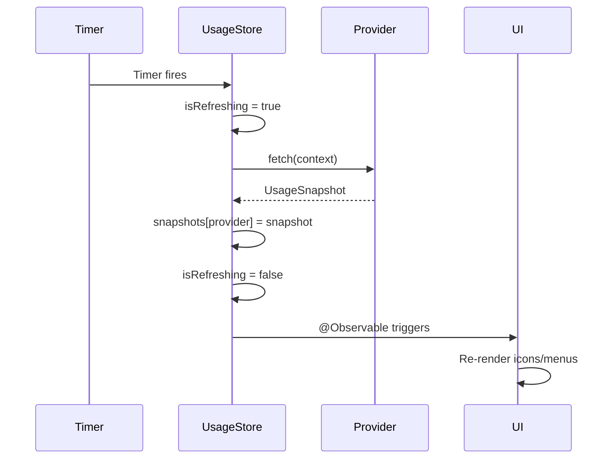

# State Management

## Overview

CodexBar uses Swift's modern **Observation framework** (`@Observable`) for reactive state management. The architecture follows a centralized store pattern with:

- **UsageStore**: Central state container for all usage data
- **SettingsStore**: User preferences and configuration
- **StatusItemController**: UI state for menu bar presentation

All stores are `@MainActor` isolated for thread-safety.

## Store Architecture

### Centralized State Pattern

```
┌──────────────────────────────────────────────────────────────────┐
│                        Application State                          │
└──────────────────────────────────────────────────────────────────┘
                                    │
          ┌─────────────────────────┼─────────────────────────┐
          │                         │                         │
          ▼                         ▼                         ▼
┌──────────────────┐    ┌──────────────────┐    ┌──────────────────┐
│   UsageStore     │    │  SettingsStore   │    │ StatusItemCtrl   │
│  (Usage Data)    │◄───│  (Preferences)   │    │  (UI State)      │
│                  │    │                  │    │                  │
│ • snapshots      │    │ • refreshFreq    │    │ • statusItems    │
│ • errors         │    │ • enabledProvs   │    │ • blinkStates    │
│ • tokenSnapshots │    │ • cookieSources  │    │ • animPhase      │
│ • credits        │    │ • debugOptions   │    │                  │
└──────────────────┘    └──────────────────┘    └──────────────────┘
```

## UsageStore

**Location**: `Sources/CodexBar/UsageStore.swift`

**Purpose**: Central store for all provider usage data, cost tracking, and status information.

### State Properties

```swift
@MainActor
@Observable
final class UsageStore {
    // Provider usage snapshots
    var snapshots: [UsageProvider: UsageSnapshot] = [:]
    var errors: [UsageProvider: String] = [:]
    var lastSourceLabels: [UsageProvider: String] = [:]
    var lastFetchAttempts: [UsageProvider: [ProviderFetchAttempt]] = [:]

    // Multi-account support
    var accountSnapshots: [UsageProvider: [TokenAccountUsageSnapshot]] = [:]

    // Token cost tracking
    var tokenSnapshots: [UsageProvider: CostUsageTokenSnapshot] = [:]
    var tokenErrors: [UsageProvider: String] = [:]
    var tokenRefreshInFlight: Set<UsageProvider> = []

    // Credits tracking
    var credits: CreditsSnapshot?
    var lastCreditsError: String?

    // OpenAI dashboard data
    var openAIDashboard: OpenAIDashboardSnapshot?
    var lastOpenAIDashboardError: String?
    var openAIDashboardRequiresLogin: Bool = false
    var openAIDashboardCookieImportStatus: String?

    // CLI version detection
    var codexVersion: String?
    var claudeVersion: String?
    var geminiVersion: String?

    // Refresh state
    var isRefreshing = false
    var refreshingProviders: Set<UsageProvider> = []

    // Provider status (from status pages)
    var statuses: [UsageProvider: ProviderStatus] = [:]

    // Debug logs
    var probeLogs: [UsageProvider: String] = [:]
}
```

### Observation Tracking

SwiftUI views observe specific properties to trigger re-renders:

```swift
// Computed token to track all observable state
var menuObservationToken: Int {
    _ = self.snapshots
    _ = self.errors
    _ = self.lastSourceLabels
    _ = self.tokenSnapshots
    _ = self.credits
    _ = self.openAIDashboard
    _ = self.isRefreshing
    _ = self.statuses
    return 0
}
```

### Settings Change Tracking

```swift
func observeSettingsChanges() {
    withObservationTracking {
        // Track settings that trigger refresh
        _ = self.settings.refreshFrequency
        _ = self.settings.statusChecksEnabled
        _ = self.settings.costUsageEnabled
        _ = self.settings.codexUsageDataSource
        _ = self.settings.claudeUsageDataSource
        // ...
    } onChange: { [weak self] in
        Task { @MainActor [weak self] in
            guard let self else { return }
            self.observeSettingsChanges()
            self.startTimer()
            await self.refresh()
        }
    }
}
```

### Refresh Flow

```swift
func refresh(force: Bool = false, providers: Set<UsageProvider>? = nil) async {
    let enabledProviders = providers ?? self.settings.enabledProviders

    self.isRefreshing = true
    defer { self.isRefreshing = false }

    await withTaskGroup(of: Void.self) { group in
        for provider in enabledProviders {
            group.addTask {
                await self.refreshProvider(provider, force: force)
            }
        }
    }

    // Update widget snapshot
    self.pushWidgetSnapshot()

    // Check status pages
    if self.settings.statusChecksEnabled {
        await self.refreshStatuses()
    }
}
```

### Error Handling with Failure Gates

```swift
/// Tracks consecutive failures to ignore single flakes
struct ConsecutiveFailureGate {
    private(set) var streak: Int = 0

    mutating func recordSuccess() {
        self.streak = 0
    }

    /// Returns true when the caller should surface the error to the UI
    mutating func shouldSurfaceError(onFailureWithPriorData hadPriorData: Bool) -> Bool {
        self.streak += 1
        // If we had prior data and this is first failure, don't surface
        if hadPriorData, self.streak == 1 { return false }
        return true
    }
}
```

## SettingsStore

**Location**: `Sources/CodexBar/SettingsStore.swift`

**Purpose**: User preferences with automatic persistence to UserDefaults.

### State Properties

```swift
@MainActor
@Observable
final class SettingsStore {
    // Refresh settings
    var refreshFrequency: RefreshFrequency {
        didSet { self.userDefaults.set(self.refreshFrequency.rawValue, forKey: "refreshFrequency") }
    }

    // Launch behavior
    var launchAtLogin: Bool {
        didSet {
            self.userDefaults.set(self.launchAtLogin, forKey: "launchAtLogin")
            LaunchAtLoginManager.setEnabled(self.launchAtLogin)
        }
    }

    // Provider settings
    private(set) var providerOrderRaw: [String]
    var enabledProviders: Set<UsageProvider> { /* computed */ }

    // Display options
    var usageBarsShowUsed: Bool
    var resetTimesShowAbsolute: Bool
    var menuBarShowsBrandIconWithPercent: Bool
    var showAllTokenAccountsInMenu: Bool

    // Feature toggles
    var statusChecksEnabled: Bool
    var sessionQuotaNotificationsEnabled: Bool
    var costUsageEnabled: Bool
    var claudeWebExtrasEnabled: Bool

    // Provider-specific cookie sources
    var codexCookieSource: ProviderCookieSource
    var claudeCookieSource: ProviderCookieSource
    var cursorCookieSource: ProviderCookieSource

    // Manual cookie headers
    var codexCookieHeader: String?
    var claudeCookieHeader: String?

    // Debug options
    var debugMenuEnabled: Bool
    var debugDisableKeychainAccess: Bool
}
```

### Persistence Strategy

All settings use immediate UserDefaults persistence via `didSet`:

```swift
var usageBarsShowUsed: Bool {
    didSet { self.userDefaults.set(self.usageBarsShowUsed, forKey: "usageBarsShowUsed") }
}
```

### Shared Defaults (App Group)

Settings shared with the widget use the App Group suite:

```swift
private static let sharedDefaults = UserDefaults(suiteName: "group.com.steipete.codexbar")
```

## StatusItemController State

**Location**: `Sources/CodexBar/StatusItemController.swift`

**Purpose**: UI state for menu bar icons and animations.

### State Properties

```swift
@MainActor
final class StatusItemController: NSObject {
    var statusItem: NSStatusItem
    var statusItems: [UsageProvider: NSStatusItem] = [:]
    var mergedMenu: NSMenu?
    var providerMenus: [UsageProvider: NSMenu] = [:]

    // Animation state
    var blinkStates: [UsageProvider: BlinkState] = [:]
    var blinkAmounts: [UsageProvider: CGFloat] = [:]
    var wiggleAmounts: [UsageProvider: CGFloat] = [:]
    var animationPhase: Double = 0
    var animationPattern: LoadingPattern = .knightRider

    // Login state
    var loginPhase: LoginPhase = .idle
    var activeLoginProvider: UsageProvider?
}
```

## Data Flow

### Unidirectional Flow

```
User Action (Settings) ──► SettingsStore ──► UsageStore.refresh() ──► UI Update
                                │
                                ▼
                          ProviderFetchPipeline
                                │
                                ▼
                          UsageSnapshot
                                │
                                ▼
                          StatusItemController
                                │
                                ▼
                          Icon + Menu Update
```

### Refresh Cycle



## Timer Management

### Refresh Timer

```swift
private func startTimer() {
    self.timerTask?.cancel()
    guard let interval = self.settings.refreshFrequency.seconds else { return }

    self.timerTask = Task { [weak self] in
        while !Task.isCancelled {
            try? await Task.sleep(for: .seconds(interval))
            guard let self else { return }
            await self.refresh()
        }
    }
}
```

### Token Cost Timer

```swift
private func startTokenTimer() {
    self.tokenTimerTask?.cancel()
    self.tokenTimerTask = Task { [weak self] in
        while !Task.isCancelled {
            try? await Task.sleep(for: .seconds(60 * 60)) // 1 hour
            guard let self else { return }
            await self.refreshTokenUsage()
        }
    }
}
```

## Widget State Sync

### Widget Snapshot Push

```swift
func pushWidgetSnapshot() {
    let entries: [WidgetSnapshot.ProviderEntry] = self.settings.enabledProviders.compactMap { provider in
        guard let snapshot = self.snapshots[provider] else { return nil }
        return WidgetSnapshot.ProviderEntry(
            provider: provider,
            updatedAt: snapshot.updatedAt,
            primary: snapshot.primary,
            secondary: snapshot.secondary,
            // ...
        )
    }

    let snapshot = WidgetSnapshot(
        entries: entries,
        enabledProviders: Array(self.settings.enabledProviders),
        generatedAt: Date()
    )

    WidgetSnapshotStore.save(snapshot)
}
```

### App Group Coordination

```swift
// Shared via App Group
private static let appGroupID = "group.com.steipete.codexbar"

// Widget reads from:
// ~/Library/Group Containers/group.com.steipete.codexbar/widget-snapshot.json
```

## Caching Strategy

### In-Memory Caching

```swift
// Observation-ignored for internal caching
@ObservationIgnored private var lastCreditsSnapshot: CreditsSnapshot?
@ObservationIgnored private var creditsFailureStreak: Int = 0
@ObservationIgnored var lastKnownSessionRemaining: [UsageProvider: Double] = [:]
@ObservationIgnored var lastTokenFetchAt: [UsageProvider: Date] = [:]
```

### Keychain Caching

```swift
// Cookie cache in Keychain
KeychainCacheStore.save(
    service: "com.steipete.codexbar.cache",
    account: "cookie.\(provider)",
    data: cookieData
)
```

### File Caching

```swift
// Cost usage cache
// ~/Library/Caches/CodexBar/cost-usage/claude-v1.json

// Dashboard cache
// ~/Library/Application Support/com.steipete.codexbar/openai-dashboard.json
```

## State Initialization

```swift
init(
    fetcher: UsageFetcher,
    browserDetection: BrowserDetection,
    claudeFetcher: (any ClaudeUsageFetching)? = nil,
    costUsageFetcher: CostUsageFetcher = CostUsageFetcher(),
    settings: SettingsStore,
    registry: ProviderRegistry = .shared,
    sessionQuotaNotifier: SessionQuotaNotifier = SessionQuotaNotifier())
{
    // Initialize fetchers
    self.codexFetcher = fetcher
    self.claudeFetcher = claudeFetcher ?? ClaudeUsageFetcher(...)
    self.costUsageFetcher = costUsageFetcher

    // Initialize failure gates per provider
    self.failureGates = Dictionary(
        uniqueKeysWithValues: UsageProvider.allCases.map { ($0, ConsecutiveFailureGate()) }
    )

    // Bind settings observation
    self.bindSettings()

    // Detect CLI versions
    self.detectVersions()

    // Initial refresh
    Task { await self.refresh() }

    // Start timers
    self.startTimer()
    self.startTokenTimer()
}
```

## Summary

| Pattern | Implementation |
|---------|----------------|
| **State Container** | `@Observable` classes (UsageStore, SettingsStore) |
| **Persistence** | UserDefaults with immediate `didSet` writes |
| **Reactive Updates** | Swift Observation framework |
| **Thread Safety** | `@MainActor` isolation |
| **Caching** | Multi-layer (memory, Keychain, file) |
| **Cross-Process** | App Group shared containers |
| **Error Resilience** | ConsecutiveFailureGate for flake tolerance |

---

**Summary**: CodexBar's state management is clean and well-organized. The `@Observable` pattern with centralized stores translates directly to container monitoring - replace `UsageSnapshot` with container metrics, and the same refresh/cache/display pipeline works identically.
